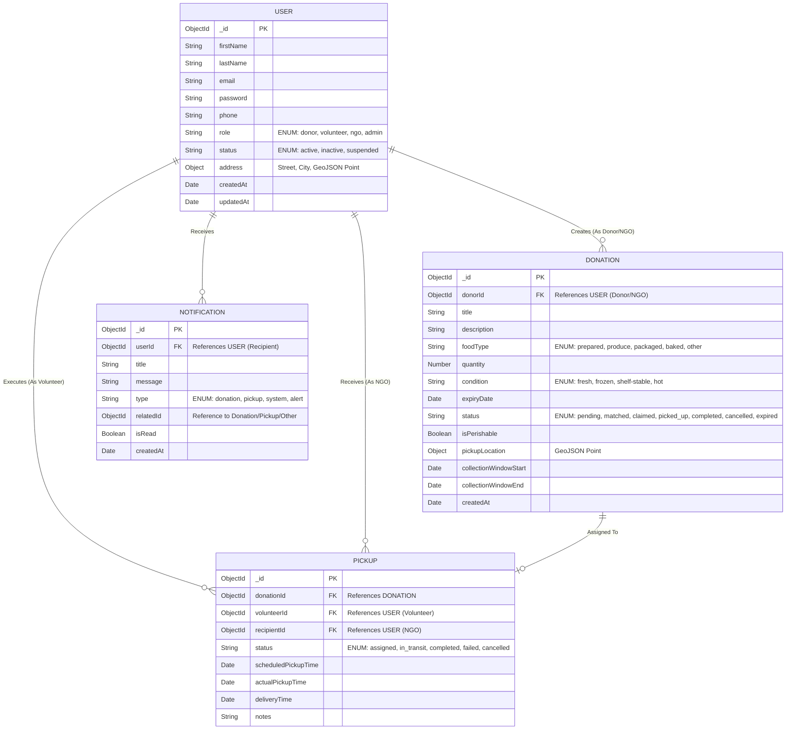

# Entity Relationship (ER) Diagram

This diagram visually represents the core collections and relationships within the MongoDB database for the FoodBridge Platform.

## Explanation of Key Relationships:

1.  **User to Donation (One-to-Many):** A User with the role `donor` or `ngo` can create multiple `Donation` documents. The `donorId` in the Donation collection points back to the User.
2.  **Donation to Pickup (One-to-One / Zero-to-One):** A `Donation` can have at most one confirmed `Pickup` attached to it at a time. The `donationId` links the Pickup document to the specific food items.
3.  **User to Pickup (One-to-Many):** 
    *   A `volunteer` User can be assigned to multiple `Pickup` events over time (`volunteerId`).
    *   An `ngo` User can be the designated recipient for multiple `Pickup` events over time (`recipientId`).
4.  **User to Notification (One-to-Many):** A User receives multiple notifications. (System generated).
