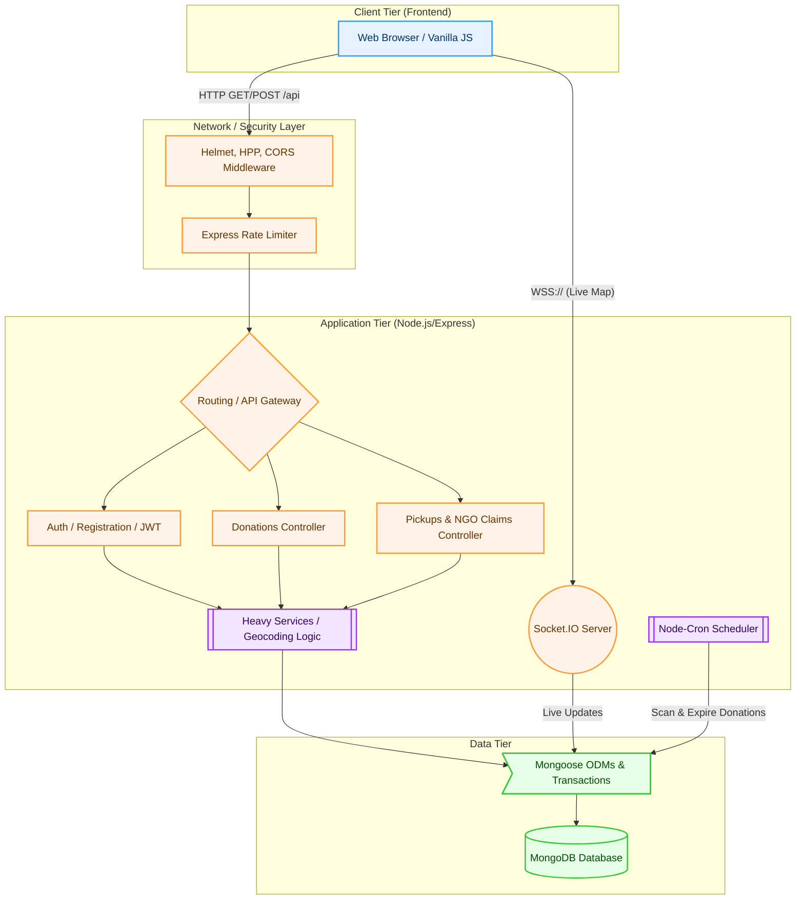

# System Architecture Diagram

This document delineates the high-level architecture of the FoodBridge application, showing the separation of concerns between standard REST traffic and real-time WebSocket connections.

## Explanation of Layers

### Client Tier
The client is a Vanilla HTML/CSS/JS interface using Tailwind CSS. 
*   **REST Calls:** Communicates via pure HTTP `fetch` requests for standard CRUD operations (Login, Add Donation, Assign Pickup).
*   **WebSockets (`ws:///wss://`):** Maintains a permanent connection with `Socket.io` solely for the **Live Map** page. When a donation changes status, the server broadcasts an event, and the client pin updates immediately without refreshing the page.

### Application Tier (Service Layer Architecture)
*   **Rate Limiting & Security:** All routes pass through an initial funnel that checks for XSS headers (`helmet`), prevents parameter pollution (`hpp`), and caps request frequency via `express-rate-limit`.
*   **Controllers (`/controllers`):** Responsible only for parsing the HTTP request (req/res loops).
*   **Services (`/services`):** This is where heavy business logic happens (e.g., scoring priorities, checking if a volunteer is near the donor).
*   **Background Jobs (`/services/cronService.js`):** A daemon runs on an interval to sweep the database for expired donations without hanging the main Node event loop.

### Data Tier
*   **MongoDB:** NoSQL database handling highly associative unstructured data.
*   **Transactions:** Mongoose ODM executes atomic transactions specifically when assigning Pickups to prevent "double booking" of donations between volunteers.
